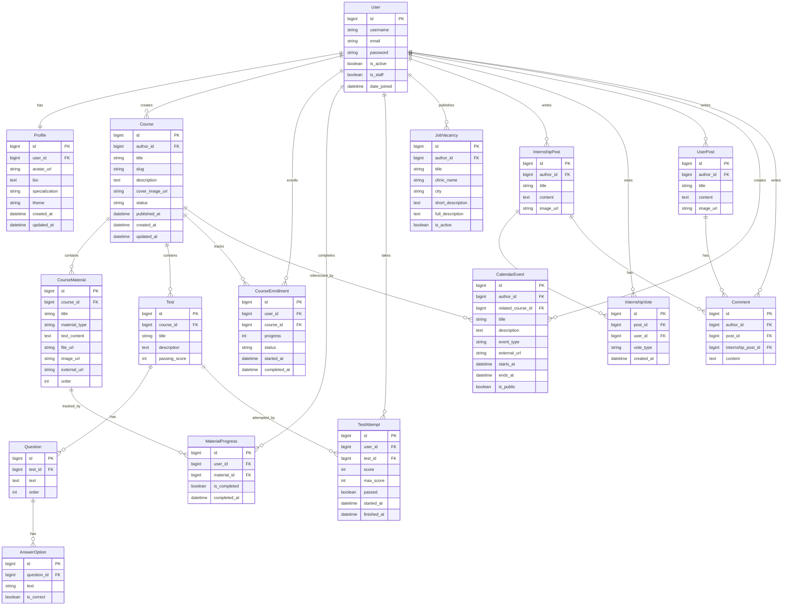

# Dentoria LMS

Dentoria — навчальна платформа для стоматологічної спільноти, написана на класичному Django з серверним рендерингом HTML-шаблонів і Bootstrap-дизайном.

## Можливості

- Реєстрація користувачів з email-активацією.
- Профіль користувача з аватаром через зовнішній URL, спеціалізацією, bio та вибором теми.
- Перемикач теми інтерфейсу: `orange`, `light`, `dark`; вибір зберігається в session і профілі.
- Курси:
  - окрема сторінка всіх опублікованих курсів;
  - окрема сторінка моїх курсів;
  - чернетки, публікація, архів;
  - матеріали типу текст, файл, зображення, посилання, відео;
  - тести та збереження результатів.
- Вакансії з детальною сторінкою та фільтрами.
- Інтернатура з постами, рейтингом `plus/minus` і сортуванням за рейтингом.
- Загальні пости для стоматологічних новин і матеріалів.
- Календар подій з публічними та приватними подіями.
- Успішність користувача за курсами, матеріалами й тестами.
- Пошук і фільтри через Django `Form` + `GET` параметри для курсів, вакансій, постів, інтернатури й календаря.
- Demo seed command з актуальним стоматологічним контентом.

## Технології

- Python
- Django
- Django Templates
- HTML
- Bootstrap 5
- PostgreSQL
- Cloudinary

Файли та картинки завантажуються користувачем через Django-форми, відправляються у Cloudinary, а в PostgreSQL зберігаються тільки отримані URL, наприклад `cover_image_url`, `image_url`, `file_url`, `avatar_url`.


## Схема моделей і звʼязків



## Швидкий локальний запуск

> Для швидкого локального запуску можна використати SQLite fallback через `USE_SQLITE_FOR_TESTS=1`.

```bash
python -m venv .venv
source .venv/bin/activate
pip install -r requirements.txt
```

Застосувати міграції:

```bash
USE_SQLITE_FOR_TESTS=1 DJANGO_DEBUG=True DJANGO_SECRET_KEY=local-dev-key python manage.py migrate
```

Наповнити сайт демо-даними:

```bash
USE_SQLITE_FOR_TESTS=1 DJANGO_DEBUG=True DJANGO_SECRET_KEY=local-dev-key python manage.py seed_demo_data
```

Запустити сервер:

```bash
USE_SQLITE_FOR_TESTS=1 DJANGO_DEBUG=True DJANGO_SECRET_KEY=local-dev-key DJANGO_ALLOWED_HOSTS=localhost,127.0.0.1 python manage.py runserver 127.0.0.1:8000
```

Відкрити сайт:

```text
http://127.0.0.1:8000/
```

## Demo акаунти

Після запуску `seed_demo_data` доступні акаунти:

```text
dentoria_editor / DemoPass123
student_demo / DemoPass123
admin_demo / DemoPass123
```

## Запуск з PostgreSQL

Створіть `.env` на основі `.env.example` і заповніть значення:

```env
DJANGO_SECRET_KEY=your-secret-key
DJANGO_DEBUG=True
DJANGO_ALLOWED_HOSTS=localhost,127.0.0.1
POSTGRES_DB=dentoria
POSTGRES_USER=dentoria
POSTGRES_PASSWORD=your-password
POSTGRES_HOST=localhost
POSTGRES_PORT=5432
```

Потім запустіть:

```bash
source .venv/bin/activate
python manage.py migrate
python manage.py seed_demo_data
python manage.py runserver
```

## Email activation

Локально за замовчуванням можна використовувати console backend, тоді лист активації друкується в термінал:

```env
EMAIL_BACKEND=django.core.mail.backends.console.EmailBackend
```

Для SMTP потрібно задати:

```env
EMAIL_BACKEND=django.core.mail.backends.smtp.EmailBackend
EMAIL_HOST=smtp.example.com
EMAIL_PORT=587
EMAIL_HOST_USER=mail@example.com
EMAIL_HOST_PASSWORD=your-password
EMAIL_USE_TLS=True
DEFAULT_FROM_EMAIL=Dentoria <noreply@example.com>
```

## Cloudinary uploads

Dentoria підтримує завантаження файлів і зображень через сайт:

1. Користувач вибирає файл у Django-формі.
2. View відправляє файл у Cloudinary через Cloudinary SDK.
3. Cloudinary повертає `secure_url`.
4. У PostgreSQL записується тільки URL.

Потрібні env-змінні:

```env
CLOUDINARY_CLOUD_NAME=your-cloud-name
CLOUDINARY_API_KEY=your-api-key
CLOUDINARY_API_SECRET=your-api-secret
```

Upload підтримується для:

- аватарки профілю → `avatar_url`;
- обкладинки курсу → `cover_image_url`;
- файлів матеріалів курсу → `file_url`;
- зображень матеріалів курсу → `image_url`;
- зображень постів інтернатури → `image_url`;
- зображень загальних постів → `image_url`.

URL-поля залишені як fallback: якщо файл уже є у Cloudinary або іншому storage, можна вставити готове посилання вручну.

## Перевірки

```bash
USE_SQLITE_FOR_TESTS=1 DJANGO_DEBUG=True DJANGO_SECRET_KEY=local-dev-key python manage.py check
USE_SQLITE_FOR_TESTS=1 DJANGO_DEBUG=True DJANGO_SECRET_KEY=local-dev-key python manage.py test
```

## Deploy на Render

У проєкті є Render config:

- `render.yaml`
- `scripts/render_build.sh`

Build script виконує:

```bash
pip install -r requirements.txt
python manage.py collectstatic --no-input
python manage.py migrate --no-input
```

Start command для Render:

```bash
gunicorn core.wsgi:application
```

На Render потрібно задати env-змінні:

```env
DJANGO_DEBUG=False
DJANGO_ALLOWED_HOSTS=your-service.onrender.com
DJANGO_CSRF_TRUSTED_ORIGINS=https://your-service.onrender.com
DJANGO_SECRET_KEY=generated-secret
DATABASE_URL=render-postgres-connection-string
EMAIL_BACKEND=django.core.mail.backends.smtp.EmailBackend
EMAIL_HOST=your-smtp-host
EMAIL_PORT=587
EMAIL_HOST_USER=your-email
EMAIL_HOST_PASSWORD=your-email-password
DEFAULT_FROM_EMAIL=Dentoria <noreply@your-domain.com>
CLOUDINARY_CLOUD_NAME=your-cloud-name
CLOUDINARY_API_KEY=your-api-key
CLOUDINARY_API_SECRET=your-api-secret
```

## Корисні команди

Створити superuser:

```bash
python manage.py createsuperuser
```

Оновити demo-контент:

```bash
USE_SQLITE_FOR_TESTS=1 DJANGO_DEBUG=True DJANGO_SECRET_KEY=local-dev-key python manage.py seed_demo_data
```

Зібрати static files:

```bash
python manage.py collectstatic
```

## Примітка про секрети

Не зберігайте реальні паролі, SMTP credentials, Cloudinary secret або production `DJANGO_SECRET_KEY` у Git. Використовуйте `.env` або змінні середовища Render.
